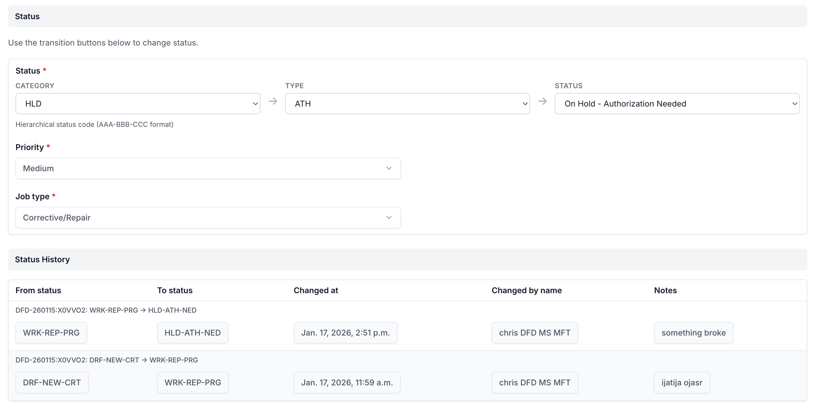

# Django FSM RX - Remanufactured Finite State Machine

[](https://github.com/specialorange/django-fsm-rx/actions/workflows/test.yml)
[](https://codecov.io/gh/specialorange/django-fsm-rx)
[](https://github.com/specialorange/django-fsm-rx/LICENSE)

Django-fsm-rx adds simple declarative state management for Django models.

## What does RX mean?

**RX = Remanufactured**

In the automotive and mechanic shop world, "RX" commonly denotes a remanufactured part - rebuilt to meet or exceed original specifications, often with improvements. This project follows that philosophy: taking the battle-tested django-fsm codebase and remanufacturing it with modern enhancements.

## About This Project

Django FSM RX is an independent fork that combines the best features from the django-fsm ecosystem:

- **Core FSM functionality** from the original [django-fsm](https://github.com/viewflow/django-fsm) by Mikhail Podgurskiy
- **Admin integration** inspired by [django-fsm-admin](https://github.com/gadventures/django-fsm-admin) and [django-fsm-2-admin](https://github.com/coral-li/django-fsm-2-admin)
- **Transition logging** inspired by [django-fsm-log](https://github.com/gizmag/django-fsm-log)
- **Full type hints** for modern Python development

This is a new independent branch, separate from both [Django Commons](https://github.com/django-commons) and [Jazzband](https://github.com/jazzband). The goal is to provide a unified, actively maintained package that combines all essential FSM features in one place.

### Why a new fork?

The original django-fsm was archived after 2 years without releases. While django-fsm-2 under Django Commons continued maintenance, this project takes a different approach by:

1. **Combining features** - Admin, logging, and core FSM in one package
2. **Independent governance** - Not tied to any organization's processes
3. **Opinionated defaults** - Built for mechanic shop / automotive industry workflows

## Installation

```bash
pip install django-fsm-rx
```

Add to your Django settings:

```python
INSTALLED_APPS = [
    ...,
    'django_fsm_rx',
    ...,
]
```

## Migration Guide

### From django-fsm

```bash
pip uninstall django-fsm
pip install django-fsm-rx
```

Your existing `from django_fsm import ...` imports will continue to work (with a deprecation warning). Update imports at your convenience:

```python
# Old (still works)
from django_fsm import FSMField, transition

# New (recommended)
from django_fsm_rx import FSMField, transition
```

### From django-fsm-2

```bash
pip uninstall django-fsm-2
pip install django-fsm-rx
```

Your existing `from django_fsm_2 import ...` imports will continue to work (with a deprecation warning). Update imports at your convenience:

```python
# Old (still works)
from django_fsm_2 import FSMField, transition

# New (recommended)
from django_fsm_rx import FSMField, transition
```

### Database Migrations for FSM Fields

Understanding when Django migrations are required:

#### Adding a New FSMField

When adding a new FSM field to a model, a migration **is required** (just like any new field):

```python
# Adding a new field - migration required
class Order(models.Model):
    status = FSMField(default='pending')  # New field
```

Run `python manage.py makemigrations` to create the migration.

#### Converting an Existing CharField to FSMField

Converting from `CharField` to `FSMField` requires **no database schema changes** because `FSMField` inherits directly from `CharField`:

```python
# Before
status = models.CharField(max_length=50, default='pending')

# After - same database column, just Python-side FSM behavior added
status = FSMField(max_length=50, default='pending')
```

**However**, Django's migration system will detect the field class change and generate a migration. This migration is safe to run - it updates Django's internal state but makes no database changes (the column remains a VARCHAR).

You can either:
1. **Run the migration** (recommended) - It's a no-op at the database level
2. **Fake it** - `python manage.py migrate --fake` if you want to skip execution

#### Converting Other Field Types

| Original Field | Target FSM Field | Migration Impact |
|----------------|------------------|------------------|
| `CharField` | `FSMField` | ✅ No schema change (same column type) |
| `IntegerField` | `FSMIntegerField` | ✅ No schema change (same column type) |
| `CharField` | `FSMIntegerField` | ⚠️ Schema change required (VARCHAR → INTEGER) |
| `IntegerField` | `FSMField` | ⚠️ Schema change required (INTEGER → VARCHAR) |
| `ForeignKey` | `FSMKeyField` | ✅ No schema change (same column type) |
| Any other type | Any FSM field | ⚠️ Check if base types match |

**Rule of thumb**: If the base Django field type matches, no schema migration is needed.

#### The `protected` Parameter

The `protected=True` parameter is Python-only and has no database impact:

```python
# protected=False (default) - allows direct assignment for backward compatibility
status = FSMField(default='pending', protected=False)
instance.status = 'approved'  # Works

# protected=True - enforces transitions only
status = FSMField(default='pending', protected=True)
instance.status = 'approved'  # Raises AttributeError
```

Use `protected=False` when converting existing code that assigns directly to the field, then gradually migrate to using transitions.

## Quick Start

```python
from django.db import models
from django_fsm_rx import FSMField, transition

class RepairOrder(models.Model):
    state = FSMField(default='intake')

    @transition(field=state, source='intake', target='diagnosis')
    def begin_diagnosis(self):
        """Vehicle moved to diagnostic bay."""
        pass

    @transition(field=state, source='diagnosis', target='awaiting_approval')
    def submit_estimate(self):
        """Estimate ready for customer approval."""
        pass

    @transition(field=state, source='awaiting_approval', target='in_progress')
    def approve_repair(self):
        """Customer approved the repair."""
        pass

    @transition(field=state, source='in_progress', target='complete')
    def complete_repair(self):
        """Repair finished, ready for pickup."""
        pass
```

## Usage

### Basic Transitions

Add an FSMField to your model and use the `transition` decorator:

```python
from django_fsm_rx import FSMField, transition

class BlogPost(models.Model):
    state = FSMField(default='draft')

    @transition(field=state, source='draft', target='published')
    def publish(self):
        """This method may contain side effects."""
        pass
```

Call the transition method to change state:

```python
post = BlogPost()
post.publish()
post.save()  # State change is not persisted until save()
```

### Checking if Transition is Allowed

```python
from django_fsm_rx import can_proceed

if can_proceed(post.publish):
    post.publish()
    post.save()
```

### Conditions

Add conditions that must be met before a transition can occur:

```python
def is_business_hours(instance):
    return 9 <= datetime.now().hour < 17

@transition(field=state, source='draft', target='published', conditions=[is_business_hours])
def publish(self):
    pass
```

### Protected Fields

Prevent direct state assignment:

```python
class BlogPost(FSMModelMixin, models.Model):
    state = FSMField(default='draft', protected=True)

post = BlogPost()
post.state = 'published'  # Raises AttributeError
```

### Source State Options

```python
# From any state
@transition(field=state, source='*', target='cancelled')
def cancel(self):
    pass

# From any state except target
@transition(field=state, source='+', target='reset')
def reset(self):
    pass

# From multiple specific states
@transition(field=state, source=['draft', 'review'], target='published')
def publish(self):
    pass
```

### Dynamic Target State

```python
from django_fsm_rx import RETURN_VALUE, GET_STATE

@transition(field=state, source='review', target=RETURN_VALUE('published', 'rejected'))
def moderate(self, approved):
    return 'published' if approved else 'rejected'

@transition(
    field=state,
    source='review',
    target=GET_STATE(
        lambda self, approved: 'published' if approved else 'rejected',
        states=['published', 'rejected']
    )
)
def moderate(self, approved):
    pass
```

### Permissions

```python
@transition(field=state, source='draft', target='published', permission='blog.can_publish')
def publish(self):
    pass

@transition(
    field=state,
    source='*',
    target='deleted',
    permission=lambda instance, user: user.is_superuser
)
def delete(self):
    pass
```

Check permissions:

```python
from django_fsm_rx import has_transition_perm

if has_transition_perm(post.publish, user):
    post.publish()
    post.save()
```

### Error Handling

Specify a fallback state if transition raises an exception:

```python
@transition(field=state, source='processing', target='complete', on_error='failed')
def process(self):
    # If this raises, state becomes 'failed'
    do_risky_operation()
```

### Signals

```python
from django_fsm_rx.signals import pre_transition, post_transition

@receiver(pre_transition)
def on_pre_transition(sender, instance, name, source, target, **kwargs):
    print(f"{instance} transitioning from {source} to {target}")

@receiver(post_transition)
def on_post_transition(sender, instance, name, source, target, **kwargs):
    print(f"{instance} transitioned to {target}")
```

### Optimistic Locking

Prevent concurrent state changes:

```python
from django_fsm_rx import ConcurrentTransitionMixin

class BlogPost(ConcurrentTransitionMixin, models.Model):
    state = FSMField(default='draft')
```

### Integer States

```python
class OrderStatus:
    PENDING = 10
    PROCESSING = 20
    SHIPPED = 30

class Order(models.Model):
    status = FSMIntegerField(default=OrderStatus.PENDING)

    @transition(field=status, source=OrderStatus.PENDING, target=OrderStatus.PROCESSING)
    def process(self):
        pass
```

### Foreign Key States

```python
class OrderState(models.Model):
    id = models.CharField(primary_key=True, max_length=50)
    label = models.CharField(max_length=100)

class Order(models.Model):
    state = FSMKeyField(OrderState, default='pending', on_delete=models.PROTECT)
```

### Model Methods

```python
# Get all declared transitions
post.get_all_state_transitions()

# Get transitions available from current state
post.get_available_state_transitions()

# Get transitions available for a specific user
post.get_available_user_state_transitions(user)
```

## Hierarchical Status Codes

Django FSM RX provides first-class support for hierarchical (multi-level) status codes. This is useful when your workflow has categories, subcategories, and granular states that follow a consistent pattern.

### Why Hierarchical Status Codes?

Traditional flat status fields work well for simple workflows:

```
draft → review → published → archived
```

But real-world applications often need more granularity:

```
DRF-NEW-CRT    (Draft / New / Created)
DRF-NEW-EDT    (Draft / New / Edited)
REV-PND-WAT    (Review / Pending / Waiting)
REV-APR-DON    (Review / Approved / Done)
PUB-ACT-LIV    (Published / Active / Live)
```

Benefits of hierarchical codes:
- **Logical grouping** - Related states share prefixes (`REV-*` = all review states)
- **Granular tracking** - Know exactly where something is in the process
- **Flexible transitions** - Move between any state in a category with one transition
- **Reporting** - Easily query/filter by category (`status LIKE 'REV-%'`)

### Designing Your Status Codes

A common pattern is `CATEGORY-TYPE-STATUS` with 3-character codes:

```python
class Job(models.Model):
    """
    Status code format: AAA-BBB-CCC

    Categories (Level 1):
        DRF = Draft
        SCH = Scheduled
        WRK = Work in Progress
        QC  = Quality Control
        CMP = Complete
        CAN = Cancelled

    Types (Level 2):
        NEW = New
        REP = Repair
        INS = Inspection
        MNT = Maintenance

    Statuses (Level 3):
        CRT = Created
        PRG = In Progress
        HLD = On Hold
        DON = Done
        FAI = Failed
    """

    STATUS_CHOICES = [
        ('DRF-NEW-CRT', 'Draft - New - Created'),
        ('DRF-NEW-EDT', 'Draft - New - Edited'),
        ('SCH-REP-CRT', 'Scheduled - Repair - Created'),
        ('SCH-INS-CRT', 'Scheduled - Inspection - Created'),
        ('WRK-REP-PRG', 'Work - Repair - In Progress'),
        ('WRK-REP-HLD', 'Work - Repair - On Hold'),
        ('WRK-INS-PRG', 'Work - Inspection - In Progress'),
        ('QC-REP-PRG', 'QC - Repair - In Progress'),
        ('QC-REP-FAI', 'QC - Repair - Failed'),
        ('CMP-REP-DON', 'Complete - Repair - Done'),
        ('CMP-INS-DON', 'Complete - Inspection - Done'),
        ('CAN-ANY-CAN', 'Cancelled'),
    ]

    status = FSMField(default='DRF-NEW-CRT', choices=STATUS_CHOICES)
```

### Category Wildcards (Prefix Matching)

Use prefix wildcards to match any state starting with a pattern:

```python
from django_fsm_rx import FSMField, transition

class Job(models.Model):
    status = FSMField(default='DRF-NEW-CRT', choices=STATUS_CHOICES)

    # Match any status starting with "WRK-" (all Work in Progress states)
    @transition(field=status, source='WRK-*', target='CMP-STD-DON')
    def complete(self):
        """Complete any work in progress."""
        pass

    # Match any status starting with "WRK-REP-" (Work + Repair category)
    @transition(field=status, source='WRK-REP-*', target='QC-REP-PRG')
    def send_to_qc(self):
        """Send repair work to quality control."""
        pass

    # Match multiple category prefixes
    @transition(field=status, source=['SCH-*', 'DRF-*'], target='WRK-REP-PRG')
    def start_repair(self):
        """Start repair work from scheduled or draft status."""
        pass

    # Combine specific states with wildcards
    @transition(
        field=status,
        source=['WRK-*', 'QC-REP-FAI'],  # Any work state OR failed QC
        target='WRK-REP-HLD'
    )
    def put_on_hold(self):
        """Put job on hold."""
        pass
```

### Supported Source Patterns

| Pattern | Description | Example Match |
|---------|-------------|---------------|
| `'*'` | Any state | All states |
| `'+'` | Any state except target | All except target state |
| `'WRK-*'` | Prefix wildcard | `WRK-REP-PRG`, `WRK-INS-HLD` |
| `'WRK-REP-*'` | Multi-level prefix | `WRK-REP-PRG`, `WRK-REP-HLD` |
| `['A', 'B']` | Specific states | Only `A` or `B` |
| `['WRK-*', 'QC-*']` | Multiple wildcards | Any WRK or QC state |

### Complete Workflow Example

```python
from django.db import models
from django_fsm_rx import FSMField, FSMModelMixin, transition

class RepairOrder(FSMModelMixin, models.Model):
    """
    Repair order with hierarchical status tracking.

    Workflow:
    1. Created as draft (DRF-NEW-CRT)
    2. Scheduled for work (SCH-REP-CRT or SCH-INS-CRT)
    3. Work begins (WRK-*-PRG)
    4. Work can be paused (WRK-*-HLD) or completed
    5. QC review (QC-*-PRG)
    6. Complete (CMP-*-DON) or back to work if QC fails
    """

    STATUS_CHOICES = [
        # Draft states
        ('DRF-NEW-CRT', 'Draft - New - Created'),
        ('DRF-NEW-EDT', 'Draft - New - Edited'),

        # Scheduled states
        ('SCH-REP-CRT', 'Scheduled - Repair - Created'),
        ('SCH-INS-CRT', 'Scheduled - Inspection - Created'),
        ('SCH-MNT-CRT', 'Scheduled - Maintenance - Created'),

        # Work in progress states
        ('WRK-REP-PRG', 'Work - Repair - In Progress'),
        ('WRK-REP-HLD', 'Work - Repair - On Hold'),
        ('WRK-INS-PRG', 'Work - Inspection - In Progress'),
        ('WRK-INS-HLD', 'Work - Inspection - On Hold'),
        ('WRK-MNT-PRG', 'Work - Maintenance - In Progress'),

        # QC states
        ('QC-REP-PRG', 'QC - Repair - Review'),
        ('QC-REP-FAI', 'QC - Repair - Failed'),
        ('QC-INS-PRG', 'QC - Inspection - Review'),
        ('QC-MNT-PRG', 'QC - Maintenance - Review'),

        # Complete states
        ('CMP-REP-DON', 'Complete - Repair - Done'),
        ('CMP-INS-DON', 'Complete - Inspection - Done'),
        ('CMP-MNT-DON', 'Complete - Maintenance - Done'),

        # Cancelled
        ('CAN-ANY-CAN', 'Cancelled'),
    ]

    status = FSMField(default='DRF-NEW-CRT', choices=STATUS_CHOICES, protected=True)
    customer_name = models.CharField(max_length=200)
    vehicle_info = models.CharField(max_length=200)

    # === Draft Phase ===

    @transition(field=status, source='DRF-NEW-CRT', target='DRF-NEW-EDT')
    def edit_draft(self):
        """Mark draft as edited."""
        pass

    @transition(field=status, source='DRF-*', target='SCH-REP-CRT')
    def schedule_repair(self):
        """Schedule as a repair job."""
        pass

    @transition(field=status, source='DRF-*', target='SCH-INS-CRT')
    def schedule_inspection(self):
        """Schedule as an inspection job."""
        pass

    @transition(field=status, source='DRF-*', target='SCH-MNT-CRT')
    def schedule_maintenance(self):
        """Schedule as a maintenance job."""
        pass

    # === Work Phase ===

    @transition(field=status, source='SCH-REP-*', target='WRK-REP-PRG')
    def start_repair(self):
        """Begin repair work."""
        pass

    @transition(field=status, source='SCH-INS-*', target='WRK-INS-PRG')
    def start_inspection(self):
        """Begin inspection work."""
        pass

    @transition(field=status, source='SCH-MNT-*', target='WRK-MNT-PRG')
    def start_maintenance(self):
        """Begin maintenance work."""
        pass

    @transition(field=status, source='WRK-REP-PRG', target='WRK-REP-HLD')
    def pause_repair(self):
        """Pause repair work (waiting for parts, etc.)."""
        pass

    @transition(field=status, source='WRK-REP-HLD', target='WRK-REP-PRG')
    def resume_repair(self):
        """Resume paused repair work."""
        pass

    # === QC Phase ===

    @transition(field=status, source='WRK-REP-PRG', target='QC-REP-PRG')
    def submit_repair_for_qc(self):
        """Submit repair for quality control."""
        pass

    @transition(field=status, source='WRK-INS-PRG', target='QC-INS-PRG')
    def submit_inspection_for_qc(self):
        """Submit inspection for quality control."""
        pass

    @transition(field=status, source='QC-REP-PRG', target='QC-REP-FAI')
    def fail_repair_qc(self):
        """Mark repair as failed QC."""
        pass

    @transition(field=status, source='QC-REP-FAI', target='WRK-REP-PRG')
    def rework_repair(self):
        """Send back to repair after failed QC."""
        pass

    # === Completion ===

    @transition(field=status, source='QC-REP-PRG', target='CMP-REP-DON')
    def complete_repair(self):
        """Mark repair as complete."""
        pass

    @transition(field=status, source='QC-INS-PRG', target='CMP-INS-DON')
    def complete_inspection(self):
        """Mark inspection as complete."""
        pass

    @transition(field=status, source='QC-MNT-PRG', target='CMP-MNT-DON')
    def complete_maintenance(self):
        """Mark maintenance as complete."""
        pass

    # === Universal Transitions ===

    @transition(field=status, source=['DRF-*', 'SCH-*'], target='CAN-ANY-CAN')
    def cancel(self):
        """Cancel job (only from draft or scheduled states)."""
        pass

    @transition(field=status, source='WRK-*', target='CAN-ANY-CAN',
                conditions=[lambda self: self.has_manager_approval])
    def cancel_in_progress(self):
        """Cancel in-progress job (requires manager approval)."""
        pass
```

## FSMCascadeWidget (Admin Interface)

When using hierarchical status codes, the standard dropdown becomes unwieldy with dozens of options. `FSMCascadeWidget` renders cascading dropdowns that filter based on selection.



*The cascade widget showing three linked dropdowns (Category → Type → Status) with status history below.*

### Basic Configuration

```python
from django.contrib import admin
from django_fsm_rx.admin import FSMAdminMixin

@admin.register(RepairOrder)
class RepairOrderAdmin(FSMAdminMixin, admin.ModelAdmin):
    list_display = ['id', 'customer_name', 'status']
    fsm_fields = ['status']

    # Configure cascade widget
    fsm_cascade_fields = {
        'status': {
            'levels': 3,           # Number of dropdown levels
            'separator': '-',      # Character separating levels
            'labels': ['Category', 'Type', 'Status'],  # Dropdown labels
        }
    }
```

### How It Works

Instead of one dropdown with all options:

```
[Select Status ▼]
  DRF-NEW-CRT - Draft - New - Created
  DRF-NEW-EDT - Draft - New - Edited
  SCH-REP-CRT - Scheduled - Repair - Created
  SCH-INS-CRT - Scheduled - Inspection - Created
  WRK-REP-PRG - Work - Repair - In Progress
  ... (20+ more options)
```

The cascade widget renders three linked dropdowns:

```
[Category ▼]     [Type ▼]        [Status ▼]
   DRF              NEW             CRT
   SCH              REP             EDT
   WRK              INS             PRG
   QC               MNT             HLD
   CMP                              DON
   CAN                              FAI
```

When you select "WRK" in Category, the Type dropdown filters to show only types available under WRK:

```
[Category ▼]     [Type ▼]        [Status ▼]
   WRK ✓           REP             PRG
                   INS             HLD
                   MNT
```

### Manual Widget Configuration

For more control, configure the widget directly:

```python
from django_fsm_rx.admin import FSMAdminMixin
from django_fsm_rx.widgets import FSMCascadeWidget

@admin.register(RepairOrder)
class RepairOrderAdmin(FSMAdminMixin, admin.ModelAdmin):
    fsm_fields = ['status']

    def formfield_for_dbfield(self, db_field, request, **kwargs):
        if db_field.name == 'status':
            # Get the object being edited (if any)
            obj = getattr(request, '_editing_obj', None)

            kwargs['widget'] = FSMCascadeWidget(
                levels=3,
                separator='-',
                labels=['Category', 'Type', 'Status'],
                choices=RepairOrder.STATUS_CHOICES,
                # Optionally filter to allowed transitions only
                allowed_targets=self._get_allowed_targets(obj) if obj else None,
            )
        return super().formfield_for_dbfield(db_field, request, **kwargs)

    def _get_allowed_targets(self, obj):
        """Get list of states this object can transition to."""
        transitions = obj.get_available_status_transitions()
        return [t.target for t in transitions]
```

### Widget Options

| Option | Type | Default | Description |
|--------|------|---------|-------------|
| `levels` | int | 2 | Number of dropdown levels |
| `separator` | str | `'-'` | Character separating levels in status code |
| `labels` | list | `['Level 1', ...]` | Labels for each dropdown |
| `choices` | list | `[]` | List of `(value, label)` tuples |
| `allowed_targets` | list | `None` | Filter to only these target states |

### Styling

The widget includes CSS for both light and dark modes. Customize by overriding in your admin CSS:

```css
/* Custom cascade widget styling */
.fsm-cascade-widget {
    display: flex;
    gap: 1rem;
}

.fsm-cascade-widget select {
    min-width: 150px;
}

.fsm-cascade-widget label {
    font-weight: bold;
    margin-bottom: 0.25rem;
}
```

### Use Cases

**Automotive/Repair Shops:**
```
WRK-ENG-DIA  (Work - Engine - Diagnostics)
WRK-ENG-REP  (Work - Engine - Repair)
WRK-BRK-INS  (Work - Brakes - Inspection)
WRK-BRK-REP  (Work - Brakes - Repair)
```

**Order Processing:**
```
ORD-NEW-RCV  (Order - New - Received)
ORD-NEW-CNF  (Order - New - Confirmed)
SHP-PCK-PRG  (Shipping - Packing - In Progress)
SHP-TRN-OUT  (Shipping - Transit - Out for Delivery)
DLV-CMP-SIG  (Delivered - Complete - Signed)
```

**Content Management:**
```
DRF-ART-WRT  (Draft - Article - Writing)
DRF-ART-EDT  (Draft - Article - Editing)
REV-LEG-PND  (Review - Legal - Pending)
REV-EDI-PND  (Review - Editorial - Pending)
PUB-WEB-LIV  (Published - Web - Live)
PUB-PRT-QUE  (Published - Print - Queued)
```

**IT Ticketing:**
```
NEW-BUG-TRI  (New - Bug - Triage)
NEW-FEA-TRI  (New - Feature - Triage)
WRK-BUG-DEV  (Work - Bug - Development)
WRK-BUG-TST  (Work - Bug - Testing)
RES-BUG-FIX  (Resolved - Bug - Fixed)
RES-BUG-WNT  (Resolved - Bug - Won't Fix)
```

## on_success Callbacks

Execute code after a successful transition without using signals:

```python
def log_completion(instance, source, target, **kwargs):
    """Called after successful transition."""
    AuditLog.objects.create(
        job=instance,
        from_status=source,
        to_status=target,
    )

@transition(
    field=status,
    source='WRK-*',
    target='CMP-STD-DON',
    on_success=log_completion
)
def complete(self):
    self.completed_at = timezone.now()
```

The callback receives:
- `instance` - The model instance
- `source` - The state before transition
- `target` - The state after transition
- `**kwargs` - Any additional arguments passed to the transition method

## Graph Visualization

Generate a visual representation of your state machine:

```bash
# Output as DOT format
python manage.py graph_transitions myapp.BlogPost > states.dot

# Output as PNG
python manage.py graph_transitions -o states.png myapp.BlogPost
```

Requires the `graphviz` package:

```bash
pip install django-fsm-rx[graphviz]
```

## Contributing

We welcome contributions! See [CONTRIBUTING.md](CONTRIBUTING.md) for detailed setup instructions.

### Quick Development Setup

```bash
# Clone and setup
git clone https://github.com/specialorange/django-fsm-rx.git
cd django-fsm-rx
uv sync

# Run tests
uv run pytest -v

# Run linting
uv run ruff check .
```

## Credits

- **Mikhail Podgurskiy** - Original django-fsm creator
- **Django Commons** - django-fsm-2 maintenance
- **Jazzband** - Original community support
- All contributors to the django-fsm ecosystem

## License

MIT License - see [LICENSE](LICENSE) for details.
